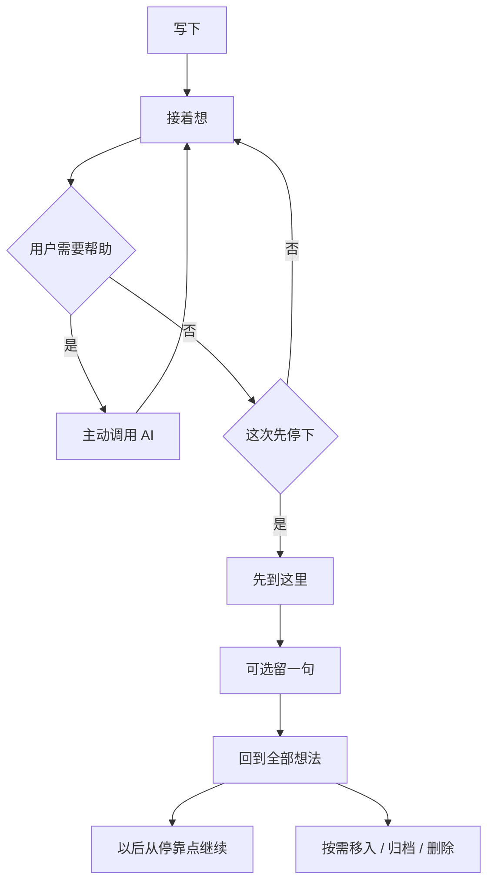

# retniw 零说明书体验收口 · 技术设计

## 决策摘要

### 实际改动点速览

| 位置 | 处理 | 结果 |
| --- | --- | --- |
| `AppHeader`、`ThoughtMenu` | 重构 | 所有浮层单开，空白点击与 Escape 关闭 |
| `ThoughtNavigation` | 重构 | 历史支持移入、归档、删除及跨端快捷操作 |
| `ThoughtWorkspace` | 增量 | 增加“先到这里”，保留继续写入口 |
| `thoughts` | 增量 | 独立保存合集、归档、删除和列表摘要 |
| `thought_collections`、`thought_checkpoints` | 新增 | 单层合集和思考停靠点分别持久化 |
| `requireUser`、`listRecent` | 重构 | 减少 Auth 网络请求和长正文重复读取 |

- 停靠、合集归属、归档和删除是四条独立状态轴，不能复用一个枚举或按钮。[PRD][用户确认]
- “先到这里”创建过程边界并返回全部想法，不自动归档、不调用 AI、不改变合集。[用户确认]
- 合集只有一层；一个想法最多属于一个合集，跨主题关系仍由“联系”表达。[用户确认]
- 隐藏手势只做快捷入口，桌面和移动端都保留可发现的显式入口。[PRD]
- 同一时刻只保留一个菜单、抽屉或对话框；完成选择、打开其他浮层、点击空白或按 Escape 后关闭。[PRD]
- 历史摘要直接存于 thought，不再为二十个 thought 读取全部 entries；列表读取量与长正文长度解耦。[设计决策]
- 身份校验使用 Supabase 官方推荐的 `getClaims()`；这里只需要可信用户 ID，不需要最新用户资料。[平台规则]
- Next.js 16 已弃用 `preferredRegion`，不在路由文件中增加过时配置；部署区域另用线上测量和平台设置验证。[平台规则]
- 数据库方言为 `postgresql`，证据来自 Supabase 项目配置、现有 UUID/RLS DDL 与 `@supabase/supabase-js` 依赖。[代码: package.json][代码: supabase/config.toml]

### 修改后流程



## 改动设计

### 前端

#### 统一浮层

- 需求/验收：打开其他操作、点击空白、按 Escape 或完成选择后，当前浮层收起；同一时刻只有一个操作层。
- 实现目标：`retniw-web`，让账号、更多、历史、导入、移入、停靠和删除确认共用一个开关模型。
- 现状逻辑与代码证据：[`AppHeader`](src/components/app-header.tsx#AppHeader)和[`ThoughtMenu`](src/components/thoughts/thought-menu.tsx#ThoughtMenu)分别使用原生`details`；[`ThoughtNavigation`](src/components/thoughts/thought-navigation.tsx#ThoughtNavigation)和导入弹层又各自维护`dialog`状态，彼此不知道对方是否打开。
- 增量修改：新增`OverlayProvider`与`useOverlayController`，用`account | thought-menu | history | import | collection | checkpoint | delete-confirm | null`联合类型保存唯一活动层。非模态菜单统一监听外部`pointerdown`和 Escape；模态同时处理 Cancel 与 backdrop 点击；关闭时焦点返回原触发器。
- 受影响符号：`AppHeader`、`ThoughtMenu`、`ThoughtNavigation`、`ImportTextDialog`、`OverlayProvider`
- 验证入口：交叉打开每种浮层，断言前一个关闭；分别使用空白点击、Escape、关闭按钮和完成操作关闭；键盘焦点回到原按钮。
- 边界与不变约束：不把普通输入或正文点击视为危险操作确认；删除确认保持模态。

#### 历史管理与合集

- 需求/验收：一个想法可移入单层合集、归档或删除；移动端支持左滑与长按，桌面支持更多与右键，语义一致。
- 实现目标：`retniw-web`，在现有导航中补齐可发现的管理入口，不新建另一套资料库页面。
- 现状逻辑与代码证据：[`ThoughtList`](src/components/thoughts/thought-navigation.tsx#ThoughtList)只渲染整块链接；没有操作入口、合集层或归档入口。
- 增量修改：拆出`ThoughtListItem`。桌面悬停或键盘聚焦显示更多，右键打开同一菜单；移动左滑只露出“归档、删除”，长按450ms打开含“移入、归档、删除”的操作抽屉。三项使用线性 SVG，文字始终保留，删除单独分组。导航先显示最近，再显示合集和归档次级入口。
- 受影响符号：`ThoughtNavigation`、`ThoughtListItem`、`ThoughtActionMenu`、`CollectionPicker`
- 验证入口：鼠标、键盘、右键、触摸左滑和长按分别执行动作；水平滑动与纵向滚动不冲突；失败时条目恢复原位置。
- 边界与不变约束：一个 thought 最多一个 collection；左滑和右键都不能永久删除。

#### 先到这里

- 需求/验收：长想法可以自然停靠并回到全部想法；下次打开从停靠点继续，且不自动归档。
- 实现目标：`retniw-web`，为连续思考增加用户主动决定的阶段边界。
- 现状逻辑与代码证据：[`ThoughtWorkspace`](src/components/thoughts/thought-workspace.tsx#ThoughtWorkspace)在每段内容后只保留继续输入和主动 AI，没有结束这一次阅读/写作的动作。
- 增量修改：有内容时在输入区之后提供次级动作“先到这里”。点击后可留一句不超过500字的备注，也可直接确认。成功后把 checkpoint 插入时间线，记录DOM位置并返回首页；重开时若没有更晚的手动阅读位置，滚到最后一个 checkpoint。
- 受影响符号：`ThoughtWorkspace`、`CheckpointDialog`、`useThoughtPosition`
- 验证入口：有备注、无备注、离线失败和重复提交；成功后回到首页，原 thought 仍在最近列表且未归档，再次打开停在边界附近。
- 边界与不变约束：不生成总结、不替用户判断完成、不调用 AI。

#### 加载与响应

- 需求/验收：点击100毫秒内出现就地状态；切换详情不整块替换导航和已显示内容。
- 实现目标：`retniw-web`，减轻已定位的等待感，不增加批量预取。
- 现状逻辑与代码证据：[`ThoughtSkeleton`](src/components/thoughts/thought-skeleton.tsx#ThoughtSkeleton)由详情段`loading.tsx`渲染并替换整个工作区；[`ThoughtNavigation`](src/components/thoughts/thought-navigation.tsx#ThoughtNavigation)中的历史链接已禁用批量预取并显示“正在打开”。
- 增量修改：移除详情段整页`loading.tsx`，保留当前已渲染工作区直到新路由提交；历史条目在点击同一帧进入`aria-busy`。菜单、滑动和乐观列表操作全部先本地反馈，再等待请求。
- 受影响符号：`ThoughtNavigation`、`app/thoughts/[id]/loading.tsx`
- 验证入口：慢速网络切换长想法，录制点击至状态出现时间；断言导航和旧正文未被骨架覆盖，只有一个详情RSC请求。

### 后端与数据

#### 想法管理与停靠

- 需求/验收：移入、归档、删除和停靠互不串联；删除可恢复；合集删除不删除想法。
- 实现目标：`retniw-api`，以独立列和独立表表达四种语义。
- 现状逻辑与代码证据：[`ThoughtRecord`](src/server/repositories/thought-repository.ts#ThoughtRecord)只有活跃时间和关系检查时间；[`EntryType`](src/server/repositories/entry-repository.ts#EntryType)只表达用户、导入和AI内容。
- 增量修改：`thoughts`增加`collection_id`、`archived_at`、`deleted_at`；新增`thought_collections`和`thought_checkpoints`。`PATCH /api/thoughts/:id`只接受`move/archive/unarchive/delete/restore`；checkpoint使用独立幂等接口，不混入用户原文或AI entry。
- 受影响符号：`ThoughtRepository`、`CollectionRepository`、`CheckpointRepository`、`PATCH /api/thoughts/[id]`、`POST /api/thoughts/[id]/checkpoints`
- 验证入口：相同请求重复执行；第二账号访问；归档后合集归属保留；删除后不能追加内容；删除合集后想法仍存在。
- 状态传导：
  - 删除：
    - 代码入口：`src/server/repositories/thought-repository.ts#ThoughtRepository`、Supabase Auth账号删除
    - 新引用结构：`thoughts.collection_id`、`thought_checkpoints.thought_id`保存既有实体ID
    - 风险：合集删除后出现幽灵归属，thought或账号删除后遗留停靠点
    - 传导/清理方案：合集外键`on delete set null`；checkpoint对thought和账号使用`on delete cascade`
    - 验证：删除合集、thought和测试账号后查询引用，预期分别解除归属或无残留记录

#### 历史摘要与身份

- 需求/验收：历史列表读取量不随长想法正文增长；详情身份校验不做不需要的远程用户资料查询。
- 实现目标：`retniw-api`，减少列表和Auth链路中的网络与数据量。
- 现状逻辑与代码证据：[`listRecent`](src/server/repositories/thought-repository.ts#listRecent)先取二十个thought，再取这些thought的全部entries，只保留第一段；[`requireUser`](src/lib/auth/require-user.ts#requireUser)每次调用`getUser()`。
- 增量修改：`thoughts`保存首段的短摘要、类型和来源；首次entry写入后只在摘要为空时填充，旧数据由一次性脚本幂等补齐。`listRecent`单次查询thoughts并按scope、collection和游标过滤。`requireUser`使用`getClaims()`并返回最小`{id}`。
- 受影响符号：`ThoughtRepository.listRecent`、`ThoughtRepository.setSummaryIfEmpty`、`requireUser`、`scripts/backfill-thought-summaries.mjs`
- 验证入口：构造包含大量entries的thought并检查列表请求；断言只发一个数据库查询且响应条数最多21。模拟合法、过期和缺少sub的claims。
- 边界与不变约束：认证路由保持`force-dynamic`和私有不缓存；若项目仍使用对称JWT，`getClaims()`可能退回远程校验，按线上计时如实记录。

### 数据库 DDL

```sql
create table public.thought_collections (
  id uuid primary key default gen_random_uuid(),
  user_id uuid not null references auth.users (id) on delete cascade,
  name text not null,
  created_at timestamptz not null default now(),
  updated_at timestamptz not null default now(),
  constraint thought_collections_user_id_id_unique unique (user_id, id),
  constraint thought_collections_user_name_unique unique (user_id, name),
  constraint thought_collections_name_length check (char_length(btrim(name)) between 1 and 80)
);

create table public.thought_checkpoints (
  id uuid primary key default gen_random_uuid(),
  user_id uuid not null references auth.users (id) on delete cascade,
  thought_id uuid not null,
  client_request_id uuid not null,
  note text not null default '',
  created_at timestamptz not null default now(),
  constraint thought_checkpoints_thought_owner_fk
    foreign key (user_id, thought_id)
    references public.thoughts (user_id, id)
    on delete cascade,
  constraint thought_checkpoints_user_request_unique unique (user_id, client_request_id),
  constraint thought_checkpoints_note_length check (char_length(note) between 0 and 500)
);

alter table public.thoughts
  add column collection_id uuid references public.thought_collections (id) on delete set null,
  add column archived_at timestamptz,
  add column deleted_at timestamptz,
  add column summary_content text,
  add column summary_entry_type text,
  add column summary_source_label text,
  add constraint thoughts_summary_content_length check (
    summary_content is null or char_length(summary_content) between 1 and 500
  ),
  add constraint thoughts_summary_entry_type_check check (
    summary_entry_type is null or summary_entry_type in ('user', 'import', 'ai')
  ),
  add constraint thoughts_summary_source_length check (
    summary_source_label is null or char_length(summary_source_label) between 1 and 255
  );

create index thought_collections_user_created_idx
  on public.thought_collections (user_id, created_at asc, id asc);

create index thought_checkpoints_user_thought_created_idx
  on public.thought_checkpoints (user_id, thought_id, created_at asc, id asc);

create index thoughts_user_state_activity_idx
  on public.thoughts (user_id, deleted_at, archived_at, last_activity_at desc, id desc);

create index thoughts_user_collection_activity_idx
  on public.thoughts (user_id, collection_id, last_activity_at desc, id desc);

alter table public.thought_collections enable row level security;
alter table public.thought_checkpoints enable row level security;
```

## 契约

### 数据契约

```ts
type ThoughtAction =
  | { action: 'move'; collectionId: string | null }
  | { action: 'archive' | 'unarchive' | 'delete' | 'restore' }

type ThoughtScope = 'active' | 'archived' | 'deleted'
```

- `GET /api/thoughts`新增`scope`和可选`collectionId`；默认`active`。响应中的thought新增`collectionId/archivedAt/deletedAt`，保留现有字段。[设计决策]
- `PATCH /api/thoughts/:id`执行`ThoughtAction`。非法输入400，不存在或非本人资源404，状态冲突409。[设计决策]
- `POST /api/thoughts/:id/checkpoints`接收`entryId/clientRequestId/note`；note为0至500字。响应为checkpoint，不创建AI或entry。[设计决策]
- `GET/POST /api/collections`列出和新建合集；`PATCH/DELETE /api/collections/:id`重命名或删除。重名409，删除自动解除归属。[设计决策]
- 删除状态的thought不能追加entry、调用AI、检查关系或新增checkpoint；归档状态仍可打开和恢复。[设计决策]
- 结构化导出增加合集、归档、删除和checkpoint状态；Markdown保留checkpoint边界，不改写原文。[PRD]

## 风险与交付

- 发布顺序：先执行新增表、可空列和索引；再幂等回填旧thought摘要；最后发布应用。任一步失败停止后续步骤。
- 旧代码忽略新增可空列，新结构保留时可直接回退应用；表和列清理由后续不可逆变更单独处理。
- 合集删除依赖外键解除归属；生产DDL执行后先用临时账号验证，再保留正式数据。
- 手势仅在水平位移显著大于垂直位移时生效；长按在移动超过8像素或开始滚动时取消。
- 快捷删除只软删除。永久删除、废纸篓清理周期和多层分类不在本轮范围。
- `getClaims()`的收益取决于JWT签名方式；上线前后分别测量，不把官方能力直接写成现网结论。

## 验证映射

| 需求/验收 | 设计落点 | 验证方式 | 证据/环境 |
| --- | --- | --- | --- |
| 打开其他操作、点击空白、按 Escape 或完成选择后，当前浮层收起；同一时刻只有一个操作层。 | `retniw-web`统一浮层 | 账号、更多、历史、导入交叉打开；空白点击与Escape | Chromium、WebKit |
| 一个想法可移入单层合集、归档或删除；移动端支持左滑与长按，桌面支持更多与右键，语义一致。 | `retniw-web`历史管理；`retniw-api`动作接口 | 更多、右键、左滑、长按各走一遍，检查数据与失败回滚 | 320、375、1024、1440像素 |
| 长想法可以自然停靠并回到全部想法；下次打开从停靠点继续，且不自动归档。 | `retniw-web`停靠；`retniw-api`checkpoint | 有无备注、重复请求、重开定位、不自动归档 | Chromium移动/桌面、真实Supabase |
| 点击100毫秒内出现就地状态；切换详情不整块替换导航和已显示内容。 | `retniw-web`加载策略 | 慢网录制点击至busy状态；检查RSC请求数量和页面壳 | 浏览器Performance/Network |
| 移入、归档、删除和停靠互不串联；删除可恢复；合集删除不删除想法。 | `retniw-web`合集入口；`retniw-api`合集与状态接口 | 新建、移入、归档、删除、恢复、删除合集；检查四条状态轴 | 本地自动测试、真实Supabase |
| 历史列表读取量不随长想法正文增长；详情身份校验不做不需要的远程用户资料查询。 | `retniw-api`摘要列与claims校验 | 大量entries下断言单次摘要查询；合法、过期、缺sub与线上TTFB对比 | Repository测试、正式域名 |
| 数据不越权且可回退 | `retniw-api`RLS与所有权过滤 | 匿名、第二账号、删除账号、回退旧应用读取 | 真实Supabase、生产构建 |

## 设计假设

- 本轮“删除”指可恢复软删除；永久删除另行确认。
- 合集按创建时间展示，合集内想法按最近活动排序；不增加手动排序。
- Vercel部署区域若只能从控制台或付费能力调整，先交付测量证据，不在代码中模拟。
