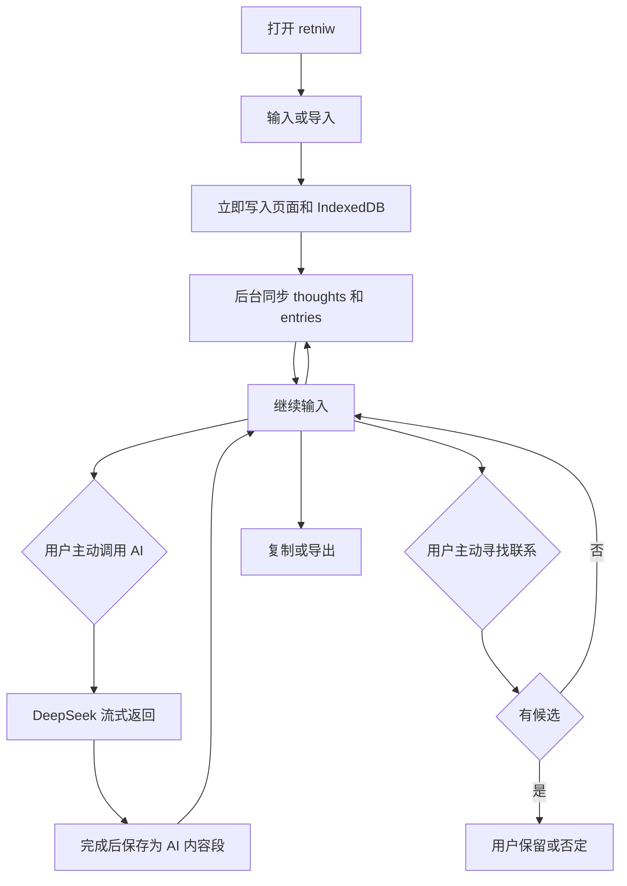

# retniw 技术设计

## 决策摘要

### 改动点

| 位置 | 处理 | 结果 |
| --- | --- | --- |
| `AppHeader`、新增 `ThoughtNavigation` | 重构 | 页头保持平面；桌面常驻、移动固定只展示“写新想法”和“以前的想法”两个导航动作 |
| `ThoughtWorkspace`、`ThoughtComposer` | 重构 | 空白状态直接说明当前动作；当前想法在主区继续；首页与详情用不同 key 隔离状态 |
| `ThinkingAssist`、`ThoughtMenu`、关系检查触发 | 重构 | 正文旁只保留“帮我接着想”；整理进入更多操作；找联系进入旧想法区域 |
| `GET /api/thoughts`、所有想法列表 | 复用 | 使用现有游标继续加载，避免把首批二十条误称为全部内容 |
| `CaptureComposer`、`FragmentTimeline` | 重写 | 保存后留在当前过程，输入始终可继续 |
| `fragments`、`clarifications`、`connections` | 停止写入 | 旧数据迁入新结构，旧表保留作回退 |
| 新增 `thoughts`、`entries`、`thought_connections` | 新建 | 分开保存思考过程、内容段和关系 |
| `DeepSeekTextProvider` | 重构 | 普通输入不调用 AI；主动操作流式返回；关系检查独立运行 |
| IndexedDB 捕捉队列 | 重构 | 从单条草稿改为按思考过程保存多段待同步内容 |
| 导入与导出 | 新增 | 浏览器读取文本文件；服务端流式导出 Markdown 和结构化数据 |

- 页面和数据围绕“思考过程”组织。一个过程可以只有一段，也可以持续追加；每段内容独立、不可覆盖。[PRD]
- 用户输入、导入内容和 AI 输出统一按发生顺序展示，但保留各自来源。普通输入只保存，不自动生成 AI 回复。[PRD]
- AI 只在用户选择“帮我接着想”、整理或找联系时介入；普通记录、导入、同步和详情回看均不自动调用模型。“帮我接着想”由模型自行选择问一个具体问题或指出一个角度，界面不暴露内部策略枚举。DeepSeek 主输出使用 SSE，页面收到首个可读片段后立即展示。[PRD][用户确认]
- 页面结构只把“写新想法”和“以前的想法”作为导航：桌面端使用常驻侧栏，移动端在主区上方使用两项常驻导航和旧想法面板；当前想法是主区状态，品牌、返回和退出不再复用为新建或切换入口。[PRD][COMPETITIVE-BRIEF]
- 关系检查只向模型发送`entryType=user|import`的内容，已有指向 AI entry 的旧候选在再次检查时标记为rejected，不再展示为用户自己的想法。[PRD][用户反馈]
- 保存、同步、AI 和关系检查是四套独立状态。任何一项失败都不撤销本地内容，也不锁住输入框。[PRD]
- `.md`、`.txt`文件由浏览器读取，不上传原文件、不增加对象存储；服务端只接收正文和来源名称。[设计决策]
- 新数据结构与旧三表并存。迁移后新代码只读写新表；旧表不删除，确认新版本稳定后再另行决定清理。[设计决策]
- 继续使用 Next.js App Router、Supabase、Vercel 和现有 DeepSeek 服务，不增加独立后端、消息队列、向量库、图数据库或第二模型供应商。[PRD]
- DeepSeek `deepseek-v4-flash`当前支持 SSE 和 1M 上下文；实现仍在服务端限制输入，避免把无关内容送给模型。[DeepSeek 官方模型说明](https://api-docs.deepseek.com/quick_start/pricing/)
- Vercel Function 请求和响应体上限为4.5 MB。单文件导入限制为1,000,000字节；导出采用流式响应，避免一次拼装全部数据。[Vercel 官方限制](https://vercel.com/docs/functions/limitations)
- 数据库方言为`postgresql`，新表DDL只使用Supabase PostgreSQL支持的表、约束、索引和RLS语法。[代码: package.json]

### 修改后流程



## 改动设计

### 前端

#### 统一的工作区导航

- 需求/验收：未听过产品介绍的用户能在5秒内找到新想法和已有想法；手机与Mac入口含义一致，不依靠返回箭头或品牌标识切换。
- 实现目标：`retniw-v2`，让新建、继续和回看成为所有工作区页面的稳定骨架。
- 现状逻辑与代码证据：[`AppHeader`](src/components/app-header.tsx#AppHeader)在详情页用返回箭头回到首页，品牌本身也链接首页，退出直接占据顶栏；[`ThoughtWorkspace`](src/components/thoughts/thought-workspace.tsx#ThoughtWorkspace)只在右栏有“最近”，900px以下会排到当前长内容末尾，且只渲染服务端首批二十条。
- 增量修改：`AppHeader`移除返回和品牌跳转，将退出收进账号入口，并去掉强制包裹整行的sticky玻璃容器。新增`ThoughtNavigation`：桌面端左侧常驻“写新想法”和可分页的“以前的想法”；移动端在主区上方常驻同样两个动作，后者打开可关闭的视口级面板。导航在文档流中占据空间，滚动时吸附在视口上沿，不覆盖输入。当前想法只在主区显示轻量状态，历史列表用第一段原文摘录并通过现有`GET /api/thoughts?cursor=`加载更多。历史链接关闭批量视口预取，只在用户实际选择时请求详情，并立即显示“正在打开”；详情正文、entries、关系与最近列表中的独立查询并行执行。`CapturePage`使用稳定`key="new-thought"`，确保从详情进入首页时卸载旧工作区状态，而不只是改变URL。
- 受影响符号：`AppHeader`、`ThoughtWorkspace`、`ThoughtNavigation`、`GET /api/thoughts`
- 验证入口：在320、375、768、1024和1440像素视口分别从空白页、短想法和长想法找到两个导航动作；从详情点击“写新想法”后断言输入区为空；创建二十一条以上想法后加载更多并打开末页内容；断网保存后立即新建，再联网回读原内容。
- 边界与不变约束：不新增标题、标签、文件夹、搜索页或独立历史路由；“以前的想法”只展示当前账号数据，复用现有服务端所有权校验。

#### 用页面状态表达产品定位

- 需求/验收：首次用户不调用AI也能完成记录、回看和另起想法，并将产品理解为承接和继续想法而非聊天。
- 实现目标：`retniw-v2`，用空白、已有内容和工具层级说明内容会去哪里。
- 现状逻辑与代码证据：旧[`ThoughtComposer`](src/components/thoughts/thought-composer.tsx#ThoughtComposer)在空白页和已有过程都显示同一句占位；旧`AiActions`把`advance/question/organize`与关系检查平铺为四个按钮；AI提示词和接口校验还强制输出“可以继续写：”，把内部动作直接暴露成产品语言。
- 增量修改：空白页只显示“写下你正在想的。”，输入提示为“写在这里”；已有内容后显示“继续写”和“接着写”。有用户内容后，正文旁只渲染[`ThinkingAssist`](src/components/thoughts/thinking-assist.tsx#ThinkingAssist)的“帮我接着想”；[`ThoughtMenu`](src/components/thoughts/thought-menu.tsx#ThoughtMenu)收纳整理、导入和导出；找联系位于旧想法区域。AI输出来源直接标成“帮我接着想”或“整理结果”，处理状态只说“正在生成”。`advance`提示词只返回一个最有用的问题或角度，不添加标题；[`aiOutputForDisplay`](src/lib/ai-output.ts#aiOutputForDisplay)清理旧数据的指令式前缀。普通内容仍按时间顺序平面展示，不使用聊天气泡。
- 受影响符号：`ThoughtWorkspace`、`ThoughtComposer`、`ThinkingAssist`、`ThoughtMenu`、`EntryContent`、`aiOutputForDisplay`
- 验证入口：全新账号完成首次保存、打开以前的想法、另起想法和回到原想法；断言空白页不存在AI操作按钮或自动模型请求。

#### 稳定的思考工作区

- 需求/验收：一句话保存后留在原处；至少可连续追加三段；AI 输出后仍可继续写；桌面与手机使用同一套功能。
- 实现目标：`retniw-v2`，把首页和详情改成同一个持续可写的工作区。
- 现状逻辑与代码证据：[`ThoughtWorkspace.handleSubmit`](src/components/thoughts/thought-workspace.tsx#handleSubmit)已经在第一次保存时用本地状态切换为当前过程，并在同步成功后无刷新替换URL；[`CapturePage`](app/page.tsx#CapturePage)和详情路由复用同一`ThoughtWorkspace`，旧fragment路由继续重定向到同ID thought。
- 增量修改：保留第一次保存后不卸载输入区、后续每次Enter追加entry和旧链接兼容；本轮只把最近过程区域改造成统一导航，不能退回单条碎片流程或保存后路由跳转。
- 受影响符号：`ThoughtWorkspace`、`CapturePage`、`ThoughtPage`、`FragmentDetailPage`
- 验证入口：从空白首页连续保存三段，断言同步期间输入区不卸载、页面无空白；在手机和桌面断点打开同一过程，断言内容和操作一致。
- 边界与不变约束：不新增聊天会话、标题、文件夹、标签或步骤向导；一段内容仍可单独构成完整过程。

#### 本地先保存与后台同步

- 需求/验收：输入下一帧可见；断网和刷新不丢；同步失败可重试；失败状态不能伪装成已同步。
- 实现目标：`retniw-v2`，把 IndexedDB 从单条捕捉队列改成按过程保存多段内容的 outbox。
- 现状逻辑与代码证据：[`CaptureItem`](src/lib/capture/capture-store.ts#CaptureItem)只保存`clientRequestId + content + state`；[`useCaptureOutbox`](src/hooks/use-capture-outbox.ts#useCaptureOutbox)成功后删除单条；当前无法表达一个过程中的多段顺序和来源。
- 增量修改：对象仓升级为`thought_outbox`，每项保存`thoughtId`、`entryId`、`clientRequestId`、`entryType`、`content`、`sourceLabel`、`state`、`createdAt`。客户端预先生成稳定 UUID，先把 entry 加到页面和 IndexedDB，再调用 API。同步成功只删除对应项；失败项留在原位置并显示“未同步”和重试。队列按本地创建顺序串行发送。
- 受影响符号：`captureStore`、`useCaptureOutbox`、`ThoughtWorkspace`、`SyncStatus`
- 验证入口：离线连续输入三段、刷新、恢复网络，断言三段仍在且按原顺序同步；对同一`clientRequestId`并发重试，数据库只有一条 entry。
- 状态传导：本地保存、远端同步、AI 和关系检查分别存储与展示；一个状态变化不清空其他状态。

#### Enter、导入和来源

- 需求/验收：Enter 保存，Shift+Enter 换行，中文输入法选词不提交；支持粘贴导入和`.md`、`.txt`文件；来源可识别。
- 实现目标：`retniw-v2`，让直接输入和外部文本进入同一工作区，同时保留来源。
- 现状逻辑与代码证据：[`ThoughtComposer`](src/components/thoughts/thought-composer.tsx#ThoughtComposer)已有Enter、Shift+Enter和`isComposing`判断；[`ImportTextDialog`](src/components/thoughts/import-text-dialog.tsx#ImportTextDialog)已支持浏览器读取文件、来源和导入目标，导入正文作为一条`entryType=import`的entry。
- 增量修改：保留键盘判定、文件限制、来源和原文不拆分规则；只把界面中的“当前过程/新过程”改成“当前想法/新想法”，普通导入仍不自动调用AI。
- 受影响符号：`ThoughtComposer`、`ImportTextDialog`、`parseImportedText`、`POST /api/thoughts`、`POST /api/thoughts/[id]/entries`
- 验证入口：导入含中文、换行和常见标点的 md/txt；断言正文逐字一致、文件名可见；不支持格式、空文件和超限文件不创建 entry。

#### 主动 AI 与流式显示

- 需求/验收：普通输入不自动回复；用户主动调用后100毫秒内有状态；逐步显示内容；失败不锁住输入。
- 实现目标：`retniw-v2`，把 AI 从固定流程改为工作区中的显式工具。
- 现状逻辑与代码证据：旧`AiActions`把`advance/question/organize`和关系检查平铺为四项操作；[`useAiAction.run`](src/hooks/use-ai-action.ts#run)与[`DeepSeekTextProvider.streamText`](src/server/ai/deepseek-text-provider.ts#streamText)已经按SSE逐段返回，但UI要求用户先理解模型策略差异，`advance`还被服务端强制加“可以继续写：”前缀。
- 增量修改：[`ThinkingAssist`](src/components/thoughts/thinking-assist.tsx#ThinkingAssist)只向用户提供“帮我接着想”，调用现有`advance`动作；服务端自行选择问一个具体问题或指出一个角度，只返回一到两句且不加标题。整理保留`organize`动作，但只出现在[`ThoughtMenu`](src/components/thoughts/thought-menu.tsx#ThoughtMenu)；`question`接口为旧客户端兼容保留，不再单独出现在界面。找联系只在旧想法区域启动关系检查。点击AI操作时立即创建本地状态并读取SSE；所有权、entries和幂等请求检查并行执行，完成后保存为AI entry，中断内容标记为未保存，不混入正式过程。
- 受影响符号：`ThinkingAssist`、`ThoughtMenu`、`StreamingAiEntry`、`useAiAction`、`aiOutputForDisplay`、`DeepSeekTextProvider.streamText`、`POST /api/thoughts/[id]/ai`
- 验证入口：普通保存时断言没有 DeepSeek 请求；逐块模拟 SSE，断言首块立刻可见；供应商超时、断流和非法响应时，原有 entries 不变且输入仍可提交。
- 边界与不变约束：AI 不自动续聊、不替用户决定下一步、不覆盖用户或导入原文。

#### 加载、回看与位置恢复

- 需求/验收：切换时先显示内容或骨架，不出现整页空白；返回同一过程后恢复阅读和输入位置。
- 实现目标：`retniw-v2`，为页面初载、过程切换和各类后台操作提供一致状态。
- 现状逻辑与代码证据：[`CapturePage`](app/page.tsx#CapturePage)在首页服务端等待最近记录后才渲染主体；[`FragmentTimeline`](src/components/fragments/fragment-timeline.tsx#FragmentTimeline)让 Clarify 和 Reconnect共用`phase`状态，页面缺少本地内容承接。
- 增量修改：新增`ThoughtSkeleton`处理无缓存初载；有本地缓存时先画已有 entries，再后台校准。页面用`sessionStorage`按`thoughtId`保存滚动位置和未提交输入位置，重新打开后恢复；跨端依赖服务端 entries 恢复内容与顺序，不把设备 A 的滚动位置强制覆盖设备 B。每个异步区域就地显示状态，不使用全屏 loading。
- 受影响符号：`ThoughtSkeleton`、`ThoughtWorkspace`、`useThoughtPosition`、`app/thoughts/[id]/loading.tsx`
- 验证入口：慢速网络下切换最近过程，断言先见骨架或缓存；同一设备离开再返回恢复位置；另一设备打开时内容与顺序一致。

#### 复制与导出

- 需求/验收：复制单段不带界面文字；导出完整过程 Markdown；导出全部内容和已确认关系的结构化数据。
- 实现目标：`retniw-v2`，输出不依赖 AI，且数据离开应用后仍可解释。
- 现状逻辑与代码证据：当前页面和 API 没有复制或导出入口，[`FragmentDetailRepository.get`](src/server/repositories/fragment-detail-repository.ts#get)只返回单条原文、澄清和当前连接。
- 增量修改：每条 entry 提供复制按钮，只复制`content`。过程菜单下载`/api/thoughts/[id]/export.md`；全量导出下载`/api/export`。两条导出接口都使用`ReadableStream`分批写出，页面显示“准备中/正在下载/失败”，失败不修改内容。
- 受影响符号：`EntryActions`、`ExportMenu`、`GET /api/thoughts/[id]/export.md`、`GET /api/export`
- 验证入口：复制一条含换行正文并与数据库逐字比对；导出 Markdown 和 JSON 后离线解析，断言顺序、来源、作者类型、稳定标识和已确认关系完整。

### 后端与数据

#### 思考过程与内容段

- 需求/验收：短内容和连续内容使用同一结构；用户、导入和 AI 内容分别保存；最近记录按过程归组。
- 实现目标：`retniw-v2`，用thoughts表示持续过程，用entries表示不可覆盖的内容段。
- 现状逻辑与代码证据：[`FragmentRepository.createIdempotent`](src/server/repositories/fragment-repository.ts#createIdempotent)每次请求都向`fragments`写一行；[`FragmentDetailRepository.get`](src/server/repositories/fragment-detail-repository.ts#get)只装载一个 fragment 和一条 clarification，无法在同一对象下继续追加任意数量内容。
- 增量修改：首次写入由`POST /api/thoughts`创建 thought 和第一条 entry；后续由`POST /api/thoughts/[id]/entries`追加。客户端提供 thought、entry 和请求 UUID。若两步写入中断，重试先读取已有记录，再补齐 entry 和`last_activity_at`，只有包含 entry 的 thought 才进入最近列表。`entries`不提供正文更新和删除接口。
- 受影响符号：`ThoughtRepository`、`EntryRepository`、`POST /api/thoughts`、`POST /api/thoughts/[id]/entries`、`GET /api/thoughts`、`GET /api/thoughts/[id]`
- 验证入口：覆盖首次写入在 thought 后失败、entry 已写入但活跃时间未更新、重复请求和并发请求；重试后断言只有一个 thought 和一条对应 entry，最近列表顺序正确。

#### 服务端身份与所有权

- 需求/验收：个人内容仅本人可访问，服务角色和模型密钥不进入浏览器。
- 实现目标：`retniw-v2`，沿用当前 Cookie 身份和服务端数据边界覆盖新表。
- 现状逻辑与代码证据：[`requireUser`](src/lib/auth/require-user.ts#requireUser)从 Supabase Cookie 会话取身份；[`createServiceClient`](src/lib/supabase/service.ts#createServiceClient)只在服务端使用，当前repository查询同时带`user_id`。
- 增量修改：新三表同样启用 RLS 且不创建浏览器策略。所有 Route Handler先`requireUser`，repository所有读取、写入和状态更新都同时限制`user_id`。非本人资源返回404。正文、导入内容、AI上下文和密钥不写日志。
- 受影响符号：`requireUser`、`createServiceClient`、`ThoughtRepository`、`EntryRepository`、`ThoughtConnectionRepository`
- 验证入口：匿名客户端、普通 Supabase 客户端和第二账号分别尝试读取与修改新三表；断言被拒绝或返回404，浏览器构建产物不含服务角色或 DeepSeek 密钥。
- 状态传导：
  - 删除：
    - 代码入口：Supabase Auth 管理端删除用户
    - 新引用结构：`thoughts.user_id`、`entries.user_id`、`thought_connections.user_id`引用`auth.users.id`
    - 风险：账号删除后残留不可访问的个人内容
    - 传导/清理方案：三表使用`on delete cascade`；旧表继续沿用已有级联约束
    - 验证：测试账号写入新旧结构后删除账号，断言所有对应记录清理

#### DeepSeek 主输出

- 需求/验收：主动调用时流式显示；AI输出单独保存；模型失败不影响用户内容。
- 实现目标：`retniw-v2`，提供文本 SSE 适配层，并在完整结束后持久化结果。
- 现状逻辑与代码证据：[`DeepSeekTextProvider.complete`](src/server/ai/deepseek-text-provider.ts#complete)固定使用非思考模式、`stream:false`和 JSON Output，适合旧 Clarify/Reconnect，但不能逐段展示自由文本。
- 增量修改：保留非思考模式和单一供应商。新增`streamText(action, entries)`，向 DeepSeek发送当前过程内按顺序整理的必要 entries，设置`stream:true`并解析`data:`事件、keep-alive和`[DONE]`。服务端向浏览器转发`start`、`delta`、`saved`、`error`事件；只有正常结束、正文非空且不超过20,000字符时，才以同一`clientRequestId`保存 AI entry。最多发送500,000字符上下文；超限不静默截断，返回`CONTEXT_TOO_LARGE`。
- 受影响符号：`DeepSeekTextProvider.streamText`、`POST /api/thoughts/[id]/ai`、`EntryRepository.createIdempotent`
- 验证入口：模拟 SSE keep-alive、多字节中文分块、`[DONE]`、限流、超时、断流和超长输出；断言事件顺序正确，只有完整输出持久化一次。

#### 关系检查与决策

- 需求/验收：关系检查仅由用户主动触发且不阻塞输入；一次最多一个候选；候选未经确认不成为长期关系；否定后不重复提出同一对。
- 实现目标：`retniw-v2`，关系建立在思考过程之间，并保留两端具体内容段作为依据。
- 现状逻辑与代码证据：关系检查已是独立请求，但入口与三项AI正文操作平铺；服务端把AI entry也发送给`findConnection`，导致模型可能把自己的旧输出当作用户想法重新连接。[`ThoughtConnectionRepository`](src/server/repositories/thought-connection-repository.ts#ThoughtConnectionRepository)已经保证候选归一化、一次决定和拒绝后不复活。
- 增量修改：关系入口只放在“以前的想法”区域。用户点击“找找旧想法的联系”后，客户端请求`POST /api/thoughts/[id]/relations/check`。服务端只保留当前过程和最近20个其他过程中的`user`或`import` entries，再交给DeepSeek最多返回一个候选及两端依据。已有指向AI entry的pending候选先标为rejected；新候选页面只并列显示“现在”和“以前”两段原文，不展示模型内部候选分析。`thought_connections`继续按 thought ID 规范化并唯一；confirmed/rejected不复活，并发唯一冲突后重读。
- 受影响符号：`DeepSeekTextProvider.findConnection`、`ThoughtConnectionRepository`、`POST /api/thoughts/[id]/relations/check`、`PATCH /api/thought-connections/[id]`
- 验证入口：覆盖普通保存、导入和详情回看均不自动检查；主动检查时覆盖单过程、无候选、非法目标、并发、已有三种状态和跨用户访问；断言输入接口不等待关系结果，否定关系不再出现。

#### 导入、导出和数据边界

- 需求/验收：外部文本原样进入；过程和全量数据可离开；导出不经过 AI。
- 实现目标：`retniw-v2`，限制输入体积，分批读取数据库并流式输出。
- 现状逻辑与代码证据：[`ThoughtComposer`](src/components/thoughts/thought-composer.tsx#ThoughtComposer)把直接输入限制为10,000字符；[`ThoughtExportRepository`](src/server/repositories/thought-export-repository.ts#ThoughtExportRepository)已按thought、entry和confirmed connection提供分页读取。
- 增量修改：直接输入仍限制10,000字符；单次导入限制1,000,000字节且 entry 正文最多1,000,000字符。Markdown导出按`created_at,id`排序写出过程元数据和 entries；全量JSON按500行分页读取 thoughts、entries和 confirmed connections，边读边写，不调用模型、不创建导出记录。
- 受影响符号：`parseEntryInput`、`ThoughtExportRepository`、`GET /api/thoughts/[id]/export.md`、`GET /api/export`
- 验证入口：分别测试边界值、超限、中文多字节、超出单次响应大小的全量导出和客户端中断；断言原数据不变且输出可重新解析。

#### 旧数据迁移

- 需求/验收：现有用户内容不清空，旧链接可继续打开，新代码不继续产生旧结构数据。
- 实现目标：`retniw-v2`，幂等迁移现有 fragments、clarifications 和 connections，并保留旧表回退。
- 现状逻辑与代码证据：[`FragmentRepository`](src/server/repositories/fragment-repository.ts#FragmentRepository)、[`FragmentDetailRepository`](src/server/repositories/fragment-detail-repository.ts#FragmentDetailRepository)和[`ConnectionRepository`](src/server/repositories/connection-repository.ts#ConnectionRepository)正在读写三张旧表；浏览器验收已经产生真实内容与关系。
- 增量修改：新增一次性`scripts/migrate-fragments-to-thoughts.mjs`。每个 fragment 迁为同 ID thought，原文迁为首条 user entry；clarification问题迁为`ai_action=question`的 AI entry，已有回答迁为后一条 user entry；旧 connection迁为 thought connection并保留 pending、confirmed或rejected状态、理由和时间。迁移标识由旧记录 ID 确定，重复执行只补缺失记录。切换新代码后旧 API 停止写入，旧表不删除。
- 受影响符号：`scripts/migrate-fragments-to-thoughts.mjs`、`fragments`、`clarifications`、`connections`、`thoughts`、`entries`、`thought_connections`
- 验证入口：对迁移前快照执行两次脚本；逐项比对用户原文、问题、回答、状态、时间和关系数量；旧 fragment URL 重定向后可读同一内容。
- 边界与不变约束：本次不执行旧表删除，不把旧自动问题误标为用户原文。

### 数据库 DDL

```sql
create table public.thoughts (
  id uuid primary key default gen_random_uuid(),
  user_id uuid not null references auth.users (id) on delete cascade,
  last_activity_at timestamptz not null default now(),
  relation_checked_at timestamptz,
  created_at timestamptz not null default now(),
  constraint thoughts_user_id_id_unique unique (user_id, id),
  constraint thoughts_relation_check_order check (
    relation_checked_at is null or relation_checked_at >= created_at
  )
);

create table public.entries (
  id uuid primary key default gen_random_uuid(),
  user_id uuid not null references auth.users (id) on delete cascade,
  thought_id uuid not null,
  client_request_id uuid not null,
  entry_type text not null,
  content text not null,
  source_label text,
  ai_action text,
  created_at timestamptz not null default now(),
  constraint entries_thought_owner_fk
    foreign key (user_id, thought_id)
    references public.thoughts (user_id, id)
    on delete cascade,
  constraint entries_user_id_id_unique unique (user_id, id),
  constraint entries_user_thought_id_unique unique (user_id, thought_id, id),
  constraint entries_user_request_unique unique (user_id, client_request_id),
  constraint entries_type_check check (entry_type in ('user', 'import', 'ai')),
  constraint entries_content_length check (
    char_length(btrim(content)) between 1 and 1000000
  ),
  constraint entries_source_label_length check (
    source_label is null or char_length(source_label) between 1 and 255
  ),
  constraint entries_ai_action_check check (
    (entry_type = 'ai' and ai_action in ('advance', 'question', 'organize'))
    or (entry_type <> 'ai' and ai_action is null)
  )
);

create table public.thought_connections (
  id uuid primary key default gen_random_uuid(),
  user_id uuid not null references auth.users (id) on delete cascade,
  source_thought_id uuid not null,
  target_thought_id uuid not null,
  source_entry_id uuid not null,
  target_entry_id uuid not null,
  rationale text not null,
  status text not null default 'pending',
  decided_at timestamptz,
  created_at timestamptz not null default now(),
  constraint thought_connections_source_thought_owner_fk
    foreign key (user_id, source_thought_id)
    references public.thoughts (user_id, id)
    on delete cascade,
  constraint thought_connections_target_thought_owner_fk
    foreign key (user_id, target_thought_id)
    references public.thoughts (user_id, id)
    on delete cascade,
  constraint thought_connections_source_entry_owner_fk
    foreign key (user_id, source_thought_id, source_entry_id)
    references public.entries (user_id, thought_id, id)
    on delete cascade,
  constraint thought_connections_target_entry_owner_fk
    foreign key (user_id, target_thought_id, target_entry_id)
    references public.entries (user_id, thought_id, id)
    on delete cascade,
  constraint thought_connections_distinct_thoughts check (
    source_thought_id < target_thought_id
  ),
  constraint thought_connections_rationale_length check (
    char_length(btrim(rationale)) between 1 and 1000
  ),
  constraint thought_connections_status_check check (
    status in ('pending', 'confirmed', 'rejected')
  ),
  constraint thought_connections_decision_state check (
    (status = 'pending' and decided_at is null)
    or (status in ('confirmed', 'rejected') and decided_at is not null)
  ),
  constraint thought_connections_pair_unique unique (
    user_id, source_thought_id, target_thought_id
  )
);

create index thoughts_user_activity_idx
  on public.thoughts (user_id, last_activity_at desc, id desc);

create index entries_user_thought_created_idx
  on public.entries (user_id, thought_id, created_at asc, id asc);

create index thought_connections_user_status_created_idx
  on public.thought_connections (user_id, status, created_at desc);

create index thought_connections_user_target_idx
  on public.thought_connections (user_id, target_thought_id);

alter table public.thoughts enable row level security;
alter table public.entries enable row level security;
alter table public.thought_connections enable row level security;
```

## 契约

### 页面与本地状态

| 契约 | 内容 | 约束 |
| --- | --- | --- |
| `/` | 空白输入、“写新想法”和“以前的想法” | 使用`key="new-thought"`隔离详情状态；保存后不跳离工作区 |
| `/thoughts/[id]` | 当前想法正文、“写新想法”和“以前的想法” | 只返回当前用户资源；返回和品牌不承担切换语义 |
| `/fragments/[id]` | 旧链接兼容 | 重定向到同 ID 的 thought |
| `/offline` | 离线冷启动 | 不缓存个人页面；恢复网络后读取 IndexedDB |
| `thought_outbox` | IndexedDB 待同步 entries | 成功后逐条删除，不冒充服务端已同步 |

### HTTP 接口

所有接口使用 Supabase Cookie 会话；成功为`{ data }`，普通失败为`{ error: { code, message, retryable } }`。SSE接口使用命名事件。非本人资源统一404。

| 接口 | 输入 | 结果 |
| --- | --- | --- |
| `POST /api/thoughts` | `thoughtId`、`entryId`、`clientRequestId`、正文、类型、来源 | 创建过程和首条 entry；重复请求返回既有结果 |
| `GET /api/thoughts` | 可空 cursor | 最近20个过程、首段摘录和下一游标 |
| `GET /api/thoughts/[id]` | thought ID | 完整 entries、关系状态和候选两端原文 |
| `POST /api/thoughts/[id]/entries` | `entryId`、`clientRequestId`、正文、类型、来源 | 追加一条 user 或 import entry |
| `POST /api/thoughts/[id]/ai` | `clientRequestId`、`action` | SSE：`start`、`delta`、`saved`或`error` |
| `POST /api/thoughts/[id]/relations/check` | thought ID | 一个候选或空结果；重复检查幂等 |
| `PATCH /api/thought-connections/[id]` | `decision: confirmed或rejected` | 只允许 pending 决定一次 |
| `GET /api/thoughts/[id]/export.md` | thought ID | 流式 Markdown 附件 |
| `GET /api/export` | 无 | 流式 JSON 附件，导出版本`retniw.export.v1` |

固定错误码为`INVALID_INPUT`、`UNAUTHENTICATED`、`NOT_FOUND`、`STATE_CONFLICT`、`CONTEXT_TOO_LARGE`、`AI_UNAVAILABLE`、`INTERNAL_ERROR`。

### 导出结构

全量 JSON 顶层包含：

- `format: "retniw.export.v1"`
- `exportedAt`
- `thoughts[]`: `id`、`createdAt`、`lastActivityAt`
- `entries[]`: `id`、`thoughtId`、`entryType`、`content`、`sourceLabel`、`aiAction`、`createdAt`
- `connections[]`: 仅 confirmed，包含`id`、两端 thought ID、两端 entry ID、`rationale`、`decidedAt`、`createdAt`

Markdown按 entry 顺序输出正文，并在每段前写入时间、作者类型和可空来源；不加入页面按钮、状态文案或模型提示词。

### DeepSeek 边界

- 只在服务端读取`DEEPSEEK_API_KEY`和模型名，继续使用`deepseek-v4-flash`非思考模式。
- “帮我接着想”和“整理这个想法”只发送当前想法中完成本次操作需要的 entries；兼容接口中的`question`不再作为独立页面入口。上下文上限500,000字符，超限明确失败，不静默丢内容。
- 关系检查只发送当前想法和最近20个旧想法中的用户原文与导入内容；模型不能选择AI entry，也只能在服务端给定候选中选择。
- 不发送邮箱、Supabase用户标识、文件本体、导出数据或身份凭据；日志只记请求标识、动作、耗时、状态码和字节数。
- 不自动切换供应商；失败后由用户重试或继续写。

## 风险与交付

- 新旧结构并存期间，先执行新表 DDL，再跑幂等迁移和数据核对，最后切换应用写入口。任一步失败都保持旧应用和旧表可读；本次不删除旧表。
- 首次创建 thought 和 entry 不是单个数据库事务。客户端稳定 ID、唯一约束和“重试补齐”闭合部分失败；只有含 entry 的 thought 对用户可见。
- Supabase服务角色绕过 RLS。所有 repository 方法必须显式接收`userId`并加过滤；禁止暴露不带所有权条件的产品查询。
- 浏览器读取文件后只发送文本和来源名。文件原始二进制不进入 Supabase、Vercel文件系统或对象存储。
- AI SSE 完成前的部分输出不算正式内容。断流时页面标为未保存，不能把半段输出混入导出。
- 工作区导航不会等待同步。离开当前路由时未同步entry必须继续保留在`thought_outbox`，重新进入对应想法或恢复网络后仍按原顺序重试。
- `last_activity_at`在 entry 写入后更新；若更新失败，接口返回可重试错误，重复请求先找到既有 entry 再补更新时间。
- Service Worker继续只缓存版本化静态资源和`/offline`；`/api`、带 Cookie 页面和导出响应不写 Cache Storage。
- 1,000,000字节单文件限制低于 Vercel 4.5 MB请求体上限并给 JSON 编码留余量；以后支持更大文件时改为分片或专用存储。
- 交付顺序：数据库与迁移 → repository和接口 → IndexedDB与稳定工作区 → AI流式输出 → 关系 → 导入导出 → 响应式和全链路验收。

## 验证映射

| 需求/验收 | 设计落点 | 验证方式 | 证据/环境 |
| --- | --- | --- | --- |
| 一句话保存后留在原处；至少可连续追加三段；AI 输出后仍可继续写；桌面与手机使用同一套功能。 | `retniw-v2`稳定工作区 | 浏览器连续追加三段并刷新回读，AI结束后再追加 | Chrome桌面与移动模拟、真实Supabase |
| 输入下一帧可见；断网和刷新不丢；同步失败可重试；失败状态不能伪装成已同步。 | 本地乐观entry、`thought_outbox`和独立同步状态 | 离线三段、刷新、联网重试并核对状态 | IndexedDB与真实API |
| Enter 保存，Shift+Enter 换行，中文输入法选词不提交；支持粘贴导入和`.md`、`.txt`文件；来源可识别。 | `ThoughtComposer`、`ImportTextDialog` | 中文输入法和键盘测试；导入中文、换行、边界和错误格式 | 浏览器与数据库比对 |
| 普通输入不自动回复；用户主动调用后100毫秒内有状态；逐步显示内容；失败不锁住输入。 | `ThinkingAssist`、本地start状态和SSE | 监听普通保存网络；延迟首块、逐块返回、503后继续输入 | Vitest流模拟、浏览器 |
| 切换时先显示内容或骨架，不出现整页空白；返回同一过程后恢复阅读和输入位置。 | 缓存内容、`ThoughtSkeleton`和`useThoughtPosition` | 慢速网络切换，离开后返回 | Chrome网络限速 |
| 复制单段不带界面文字；导出完整过程 Markdown；导出全部内容和已确认关系的结构化数据。 | Clipboard、流式Markdown和`retniw.export.v1` | 逐字比对复制；下载后离线解析两类导出 | Chrome、Node解析脚本 |
| 短内容和连续内容使用同一结构；用户、导入和 AI 内容分别保存；最近记录按过程归组。 | `thoughts + entries`和entry类型 | 单段与多段写入后查询最近列表和详情 | 真实Supabase |
| 个人内容仅本人可访问，服务角色和模型密钥不进入浏览器。 | RLS无客户端策略、服务端userId过滤 | 匿名、普通客户端、第二账号访问并扫描浏览器包 | 自动测试、真实Supabase |
| 主动调用时流式显示；AI输出单独保存；模型失败不影响用户内容。 | `DeepSeekTextProvider.streamText`和AI entry | SSE成功、超时、断流、非法输出 | Vitest、真实DeepSeek |
| 关系检查仅由用户主动触发且不阻塞输入；一次最多一个候选；候选未经确认不成为长期关系；否定后不重复提出同一对。 | 独立关系接口、唯一约束和状态分支 | 普通保存无模型调用；主动并发检查、持续输入、rejected后重复检查 | Vitest、真实Supabase |
| 外部文本原样进入；过程和全量数据可离开；导出不经过 AI。 | import entry和服务端流式导出 | 原文比对；超过4.5MB时导出并确认没有模型请求 | Vercel预览、真实Supabase |
| 现有用户内容不清空，旧链接可继续打开，新代码不继续产生旧结构数据。 | 幂等迁移、旧链接重定向和旧写入口停用 | 迁移前后逐项核对，脚本重复执行，保存新内容后查旧表 | Supabase快照、迁移报告 |
| 未听过产品介绍的用户能在5秒内找到新想法和已有想法；手机与Mac入口含义一致，不依靠返回箭头或品牌标识切换。 | 统一工作区导航 | 跨320至1440像素视口检查“写新想法”和“以前的想法”；从详情新建后输入区必须为空；超过20条后加载更多 | Chromium、真实账号 |
| 首次用户不调用AI也能完成记录、回看和另起想法，并将产品理解为承接和继续想法而非聊天。 | `retniw-v2`状态文案和次级AI入口 | 全新账号完成无AI闭环；检查空白页无AI操作和自动模型请求 | 浏览器网络面板、首次用户脚本 |
| AI只在用户主动需要时介入，不要求用户理解模型策略。 | 分层的`ThinkingAssist`、`ThoughtMenu`和手动关系检查 | 普通保存、导入和详情回看无DeepSeek请求；“帮我接着想”无指令式前缀；整理与找联系位于各自上下文；关系输入无AI entry | Vitest、真实DeepSeek、Playwright |

实现完成后统一运行`npm run lint`、`npm run typecheck`、`npm test`、`npm run build`，再执行真实Supabase迁移核对、DeepSeek流式调用、桌面与手机浏览器验收。性能记录以用户点击时刻、状态出现时刻和首个可读 SSE 片段时刻计算，不把测试 Mock 当作3秒目标证据。

## 设计假设

- 当前真实旧数据需要保留；选择非破坏迁移，不把“项目仍在早期”解释为可以清空用户内容。
- 当前是多个独立内测账号，不增加多成员、共享和权限角色；所有想法列表继续以现有账号所有权条件隔离。
- 直接输入沿用当前10,000字符上限；文件导入放宽到1,000,000字节，以支持普通长文本同时远低于平台请求体限制。
- 最近关系候选沿用当前20个对象的范围；首版不为提高召回率增加向量或图系统。
- 同一设备恢复精确滚动和光标位置；跨设备恢复内容、顺序和可继续输入状态，不同步像素级滚动位置。
- 旧表清理、更多文件格式、语音、第三方平台接入和可视化图谱不在本次交付内。
