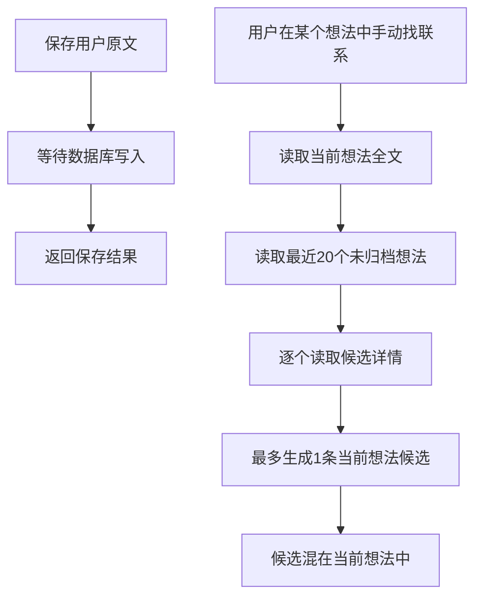

# retniw 零说明书体验收口 V2.4 · 技术设计

## 决策摘要

### 实际改动点速览

| 位置 | 处理 | 结果 |
| --- | --- | --- |
| [`ThoughtNavigation`](src/components/thoughts/thought-navigation.tsx#ThoughtNavigation) | 重构 | 最近内容为历史根；合集、归档、回看为次级入口；移除已删除视图 |
| [`ThoughtListItem`](src/components/thoughts/thought-list-item.tsx#ThoughtListItem)、[`ThoughtActionMenu`](src/components/thoughts/thought-action-menu.tsx#ThoughtActionMenu) | 重构 | 删除强确认后调用 HTTP DELETE；不再提供恢复 |
| `app/review`、`ReviewWorkspace` | 新增 | 独立承接开启说明、联系候选和已经保留的联系，不提供聊天输入 |
| [`POST /api/thoughts`](app/api/thoughts/route.ts#POST)、追加内容POST路由 | 增量 | 新用户原文同步成功后用 Next `after()`安排有界回看，不延长保存响应 |
| [`ThoughtConnectionRepository`](src/server/repositories/thought-connection-repository.ts#ThoughtConnectionRepository) | 复用并扩展 | `pending / confirmed / rejected`继续表示候选、保留、忽略；增加全局批量读取 |
| `user_review_preferences` | 新增 | 用户级回看开关默认关闭，跨设备同步，账号删除时级联清理 |
| `entries.review_checked_at`、[`EntryRepository.claimForReview`](src/server/repositories/entry-repository.ts#claimForReview) | 新增 | 每条user/import entry独立原子认领；重复回调只处理一次，乱序回调互不覆盖 |
| [`ThoughtConnectionRepository.listForReview`](src/server/repositories/thought-connection-repository.ts#listForReview)、[`countForReview`](src/server/repositories/thought-connection-repository.ts#countForReview) | 重构 | 四个精确外键内连接先过滤可见关系，再分页、计数并直接序列化 |
| [`ThoughtRepository`](src/server/repositories/thought-repository.ts#ThoughtRepository)、[`ThoughtExportRepository`](src/server/repositories/thought-export-repository.ts#ThoughtExportRepository) | 重构 | 新删除物理执行；历史软删除行继续隐藏并从回看、合集和导出排除 |

- 产品状态只分三层：用户原文是记录，AI产出的是联系候选，用户保留后才进入回看中的长期联系；不新增图数据库或回看快照表。[PRD][用户确认]
- 当前想法中的“帮我接着想”和“整理”仍只在用户主动调用时使用当前想法；后台能力只负责跨想法比较，不生成正文、不续写、不分类。[PRD][用户确认]
- 回看默认关闭。后台任务先读取用户级开关，只有已开启才读取并发送必要的新旧用户原文；关闭后新保存不再触发比较。[用户确认]
- `thought_connections`继续作为唯一关系真相源；同一对想法沿用规范化顺序和唯一约束，任何既有`pending / confirmed / rejected`都会阻止重复候选。[现有仓库: ThoughtConnectionRepository]
- 归档是“以前的想法”的子视图，仍可参与跨想法比较；`deleted_at is not null`的历史行在所有产品读取中继续排除，本轮不批量物理清理。[用户确认]
- 新删除由`DELETE /api/thoughts/:id`物理执行，只命中`deleted_at is null`且属于当前用户的行；`PATCH`不再承担删除或恢复。[设计决策]
- 保存后的回看使用 Next.js 16 `after()`；Vercel通过`waitUntil`延长函数生命周期，回调受路由`maxDuration`限制，因此失败只能降级为本次不产出候选，不能反向改变保存结果。每个user/import entry用自己的`review_checked_at`独立原子认领：同一entry重试只处理一次，不同entry即使回调乱序也各自处理。[平台规则][设计决策]
- 数据库方言为`postgresql`，证据来自 Supabase 配置、现有迁移和`@supabase/supabase-js`依赖；本轮结构增量为用户回看偏好表与entry级可空认领列。[代码: package.json][代码: supabase/config.toml]

### 现状流程



### 修改后流程

```mermaid
flowchart TD
    A[用户原文或导入内容写入成功] --> B[立即返回保存结果]
    B --> C[after 后台回调]
    C --> D{回看已开启}
    D -->|否| E[结束，不读取旧内容]
    D -->|是| F{原子认领当前entry}
    F -->|已处理或AI entry| E
    F -->|认领成功| G[读取当前新原文和最多20条历史摘要]
    G --> H[排除删除内容和已有关系对]
    H --> I[DeepSeek返回0至3个有锚点候选]
    I --> J[幂等写入 pending 联系]
    J --> K[/review 展示]
    K -->|保留| L[confirmed]
    K -->|忽略| M[rejected]
```

## 改动设计

### 前端

#### 历史根与归档子视图

- 需求/验收：进入归档后不出现“全部”或“已删除”标签；取消归档后回到最近内容，合集归属不变。
- 实现目标：`retniw-web`，把历史根、合集和归档恢复为清楚的父子层级。
- 现状逻辑与代码证据：[`ThoughtNavigation`](src/components/thoughts/thought-navigation.tsx#ThoughtNavigation)用`recent | archived | deleted | collection`一个联合状态渲染，根部把“全部、归档、已删除”放在同一区域。
- 增量修改：视图类型只保留`recent | archived | collection`。根视图先显示最近想法，再显示合集，末尾提供“归档”和“回看”次级入口；归档视图顶部使用返回按钮与标题“归档”，空态为“还没有归档的想法。”。移动历史面板与桌面侧栏复用同一内容结构。
- 受影响符号：`ThoughtNavigation`、`navigationContent`、`View`、`GET /api/thoughts`
- 验证入口：桌面侧栏与移动历史面板分别进入和退出归档；验证无同级筛选、无删除区、归档空态、取消归档后合集ID未变化。
- 边界与不变约束：合集仍为单层；归档只改变`archived_at`，不改变原文、合集、停靠点或关系。

#### 永久删除交互

- 需求/验收：所有删除入口都先强提醒，确认后无法恢复，想法、内容和相关联系不可再读取。
- 实现目标：`retniw-web`，统一桌面更多/右键和移动左滑/长按的危险操作语义。
- 现状逻辑与代码证据：[`ThoughtActionMenu`](src/components/thoughts/thought-action-menu.tsx#ThoughtActionMenu)包含`restore`动作；[`ThoughtListItem`](src/components/thoughts/thought-list-item.tsx#ThoughtListItem)为`deleted`提供专用模式；[`ThoughtNavigation`](src/components/thoughts/thought-navigation.tsx#ThoughtNavigation)确认文案承诺可恢复。
- 增量修改：删除`deleted`模式、恢复图标和恢复动作。所有删除入口只打开同一个模态框，标题“删除这个想法？”，正文“删除后无法恢复，相关联系也会一并删除。”，按钮“取消 / 删除”。确认按钮提交期间禁用；收到204后乐观移除并在删除当前想法时进入`/`，失败则恢复条目并保留重试提示。
- 受影响符号：`ThoughtActionMenu`、`ThoughtListItem`、`ThoughtNavigation.performAction`、删除确认`dialog`
- 验证入口：更多、右键、左滑、长按分别触发；取消不发请求；重复点击只发一次DELETE；成功后前进、后退、直接访问原链接均无法读取。
- 边界与不变约束：手势只揭示“删除”，不能绕过确认；删除合集仍是另一条只解除归属的契约。

#### 独立回看页面

- 需求/验收：首次开启前说明处理范围；候选可回到两端原文，保留的联系可再次打开；页面不被理解为聊天。
- 实现目标：`retniw-web`，新增动态路由/review和ReviewWorkspace，并复用现有应用顶栏、历史导航、SVG线条与颜色变量。
- 现状逻辑与代码证据：本轮修改前，[`ThoughtWorkspace`](src/components/thoughts/thought-workspace.tsx#ThoughtWorkspace)在当前想法末尾展示关系候选，[`ThoughtNavigation`](src/components/thoughts/thought-navigation.tsx#ThoughtNavigation)提供手动检查入口；两个入口在本轮统一移出当前想法。
- 增量修改：移除当前想法末尾的候选和侧栏手动找联系入口。`/review`主区按“等你判断 / 已保留”两层展示；每张候选并列显示最多1000字的“这次写的 / 以前写的”原文摘录、简短依据和“保留 / 忽略”。两端均链接`/thoughts/:id#entry-:entryId`，正文entry增加稳定DOM锚点。没有候选时只显示事实空态，不生成总结或推荐话术。
- 受影响符号：`app/review/page.tsx`、`ReviewWorkspace`、`ConnectionCard`、`ThoughtNavigation`、`ThoughtWorkspace`、entry DOM锚点
- 验证入口：未开启、已开启无候选、有候选、有已保留联系、分页失败分别回放；手机和桌面都能从“以前的想法”进入并回到两端原文。
- 边界与不变约束：页面没有输入框；待判断数量只在回看入口旁克制提示，不弹窗、不抢焦点、不阻断记录。

#### 回看开关与隐私说明

- 需求/验收：默认关闭，明确开启后才发送跨想法内容，关闭后新保存不再处理。
- 实现目标：`retniw-web`，用一个可访问的开关表达真实状态，不使用一次性浏览器标记。
- 现状逻辑与代码证据：[`LoginPage`](app/login/page.tsx#LoginPage)只说明主动AI会发送“当前想法”，项目中没有用户级跨设备回看偏好。
- 增量修改：首次进入关闭状态时显示PRD中的完整说明和“开启”按钮；已开启时提供“关闭回看”，操作立即更新页面状态并提交偏好接口，失败恢复原状态。登录页同步说明：主动使用当前想法AI，或开启回看后，必要内容会交给DeepSeek处理。
- 受影响符号：`ReviewWorkspace`内的偏好控制、`app/login/page.tsx`
- 验证入口：新账号、已有账号、跨设备重登、开启失败和关闭失败；未开启连续保存三次时Network中没有DeepSeek回看请求。

### 后端与数据

#### 新请求永久删除

- 需求/验收：确认后物理删除当前用户的可见想法及从属内容；历史软删除数据继续隐藏且不批量清理。
- 实现目标：`retniw-api`，把数据生命周期从可恢复状态改为明确删除请求。
- 现状逻辑与代码证据：[`ThoughtRepository.updateAction`](src/server/repositories/thought-repository.ts#ThoughtRepository)通过写`deleted_at`实现delete/restore；当前`PATCH /api/thoughts/:id`承载全部管理动作。
- 增量修改：新增`ThoughtRepository.deleteOwned(userId, thoughtId)`，执行带`user_id`、`id`和`deleted_at is null`条件的物理删除并检查返回行；路由新增`DELETE`并成功返回204。`PATCH`只接受move/archive/unarchive；`GET /api/thoughts`只接受active/archived，所有合集、详情、回看和导出查询显式增加`deleted_at is null`。旧软删除行不能由新DELETE命中。
- 受影响符号：`ThoughtRepository.deleteOwned`、`DELETE /api/thoughts/:id`、`parseThoughtAction`、`ThoughtExportRepository`
- 验证入口：本人可见想法删除204；重复删除、旧软删除ID和其他账号ID均404；删除后entries、checkpoints和两端connections为0；归档想法仍可删除。
- 边界与不变约束：不提供恢复端点，不运行历史`deleted_at is not null`清理；删除失败不在前端伪装成功。

#### 用户级回看偏好

- 需求/验收：新旧账号默认关闭；明确开启和关闭随账号跨设备同步。
- 实现目标：`retniw-api`，新增user_review_preferences作为唯一用户级开关，不向每个thought复制状态。
- 现状逻辑与代码证据：现有迁移只有thought、collection和checkpoint生命周期结构，没有用户产品偏好表；服务端路由均先[`requireUser`](src/lib/auth/require-user.ts#requireUser)再使用service-role客户端按`user_id`过滤。
- 增量修改：没有偏好行等价于`enabled=false`；`ReviewPreferenceRepository.set`以`user_id`幂等upsert布尔值和`updated_at`。所有读取和写入先认证，匿名401，其他账号资源不暴露。
- 受影响符号：`ReviewPreferenceRepository`、`GET /api/review`、`PATCH /api/review/preference`
- 验证入口：无行默认false；开启、关闭、重复提交和跨设备读取；第二账号不共享；删除测试账号后偏好行为0。
- 状态传导：
  - 删除：
    - 代码入口：Supabase Auth账号删除、`ReviewPreferenceRepository`
    - 新引用结构：`user_review_preferences.user_id`保存`auth.users.id`
    - 风险：账号删除后留下无主体的回看开关
    - 传导/清理方案：外键`on delete cascade`
    - 验证：删除临时账号后按`user_id`查询偏好表，预期0行

#### 保存后的有界回看

- 需求/验收：开启后保存仍立即完成；最多生成三条有两端原文依据的候选，失败不影响保存和继续输入。
- 实现目标：`retniw-api`，抽出ReviewService.processSavedEntry，让普通保存与模型处理只有“成功entry标识”这一条单向依赖。
- 现状逻辑与代码证据：两个entry POST路由等待写入、touch和摘要后响应；当前`POST /api/thoughts/:id/relations/check`读取当前详情，再对最近20个active thought逐个`getDetail`，最后调用[`findConnection`](src/server/ai/deepseek-text-provider.ts#DeepSeekTextProvider)。
- 增量修改：当entry、touch和摘要步骤全部成功且类型为`user | import`时，无论本次entry是新建还是幂等重放，都在组装成功响应前调用`after(() => processSavedEntry({userId, thoughtId, entryId, processedThrough}))`；两个路由设置`maxDuration=60`。`processedThrough`只保留保存结果中的时间信息，不参与认领判断。后台先读偏好，关闭时立即返回；开启后调用`EntryRepository.claimForReview(userId, thoughtId, entryId)`，用`user_id + thought_id + id + entry_type in (user, import) + review_checked_at is null`一次更新并返回源entry。没有返回行表示同一entry已被处理、越权或属于AI entry，回调立即结束；不同entry各自拥有认领列，不受创建时间和`after()`到达顺序影响。认领成功后，以返回entry前2000字为源，以最多20个`deleted_at is null`且可含归档的thought首段摘要（每条最多500字）为候选；排除当前thought及任何已有关系对。排除集合只接受合法UUID，并在数据库查询中先执行`id not in (...)`再`limit 20`，避免已有关系占满召回窗口。DeepSeek超时45秒，只能返回候选集内0至3个target thought ID和每条不超过300字的依据；目标锚点取该thought首条user/import entry，持久化仍走`createCandidate`。
- 受影响符号：`POST /api/thoughts`、`POST /api/thoughts/:id/entries`、`ReviewService.processSavedEntry`、`EntryRepository.claimForReview`、`DeepSeekTextProvider.findConnections`、`ThoughtRepository.listReviewCandidates`、`EntryRepository.firstUserEntry`
- 验证入口：保存响应时间不包含模型等待；开关关闭不认领、不读取候选且不调用DeepSeek；同一entry幂等重放只认领一次，不同entry无论回调顺序都各认领一次，AI entry不可认领；归档可入选、软删除不可入选；0/1/3/越界/伪造ID模型结果；超时和供应商错误只留下服务端无正文错误记录。
- 边界与不变约束：不增加队列、定时任务、向量库或第二模型；不发送AI entry、checkpoint、合集名、账号标识或其他账号内容；日志只记用户无关的结果码与耗时。

#### 候选幂等、竞态与全局读取

- 需求/验收：同一对想法忽略后不再出现，保留后可持续查看；并发保存不产生重复边。
- 实现目标：`retniw-api`，以entry级原子认领隔离后台回调，再复用thought_connections的规范化pair和三态完成关系幂等与批量列表。
- 现状逻辑与代码证据：[`ThoughtConnectionRepository.createCandidate`](src/server/repositories/thought-connection-repository.ts#ThoughtConnectionRepository)先规范化两端顺序，遇到既有pair或23505竞态时读取已有记录；`decide`只允许pending一次性进入confirmed/rejected。
- 增量修改：`EntryRepository.claimForReview`只在指定user/import entry的`review_checked_at`为空时写入当前时间并返回该行；同一entry重放或重复回调未命中，不同entry即使较新的回调先执行也不会阻止旧entry认领。`listExistingTargets`在模型调用前排除三种状态；多条候选逐条复用`createCandidate`。`listForReview(status, cursor)`通过四个精确外键`thought_connections_source_thought_owner_fk`、`thought_connections_target_thought_owner_fk`、`thought_connections_source_entry_owner_fk`和`thought_connections_target_entry_owner_fk`做`!inner`嵌入，在`limit 21`前过滤两端`deleted_at is null`及两端锚点`entry_type in (user, import)`，然后直接把嵌入行序列化为最多20条、每端最多1000字的页面数据，不再分页后补查或过滤。`countForReview`复用相同可见性查询并使用`count: exact, head: true`；API只在pending首屏请求该计数，confirmed或后续分页不重复计算。rejected不返回页面。移除当前thought手动关系检查路由及其客户端调用，避免形成第二套候选入口。
- 受影响符号：`EntryRepository.claimForReview`、`ThoughtConnectionRepository.listExistingTargets`、`createCandidate`、`listForReview`、`countForReview`、`GET /api/review`、`PATCH /api/thought-connections/:id`
- 验证入口：开关关闭不认领；同entry幂等重放可以重复安排回调但只认领和调用模型一次；两个不同entry以任意顺序回调时均各自认领和处理一次；AI entry不可认领；同pair并发插入最多一行；四个精确FK嵌入与exact head计数在生产PostgREST冒烟通过；confirmed/rejected不能再次决定；删除任一端后列表和计数都不包含该关系。
- 边界与不变约束：回看不是一次生成的报告，不保存页面快照；confirmed和pending继续随两端thought物理删除而级联清理。

### 数据库 DDL

```sql
create table public.user_review_preferences (
  user_id uuid primary key references auth.users (id) on delete cascade,
  enabled boolean not null default false,
  updated_at timestamptz not null default now()
);

alter table public.user_review_preferences enable row level security;

alter table public.entries
  add column if not exists review_checked_at timestamptz null;
```

## 契约

### 页面与数据契约

```ts
type ThoughtAction =
  | { action: 'move'; collectionId: string | null }
  | { action: 'archive' | 'unarchive' }

type ThoughtScope = 'active' | 'archived'

type ReviewPreference = {
  enabled: boolean
  updatedAt: string | null
}

type ReviewConnection = {
  id: string
  status: 'pending' | 'confirmed'
  source: { thoughtId: string; entryId: string; excerpt: string }
  target: { thoughtId: string; entryId: string; excerpt: string }
  rationale: string
  decidedAt: string | null
  createdAt: string
}
```

- `/review`是认证后的动态页面；未登录重定向`/login`，不存在公开分享或缓存。[现有认证契约]
- `GET /api/thoughts`只接受`scope=active | archived`和可选`collectionId/cursor`；`deleted`返回400。[设计决策]
- `PATCH /api/thoughts/:id`只执行`ThoughtAction`；`DELETE /api/thoughts/:id`成功204，非法ID 400，不存在、已软删除或非本人资源404，约束冲突409。[设计决策]
- `GET /api/review?status=pending|confirmed&cursor=`返回`preference/connections/nextCursor`；默认pending，每页20条。`pendingCount`只在pending首屏返回，confirmed和带cursor的后续页省略，避免重复exact计数。[设计决策]
- `PATCH /api/review/preference`只接受`{enabled:boolean}`，返回`ReviewPreference`；重复设置同值成功且更新时间不倒退。[设计决策]
- `PATCH /api/thought-connections/:id`沿用`{decision:'confirmed'|'rejected'}`；只有pending可决定，重复同一决定幂等成功，相反决定409。[现有仓库]
- 结构化导出继续只包含confirmed关系；thought、entry、checkpoint和connection查询都以未删除thought为集合边界。为兼容`retniw.export.v1`，`deletedAt`字段暂时保留但导出值只会为null。[设计决策]

## 风险与交付

- 2026-08-24已将`user_review_preferences`与`entries.review_checked_at`两项迁移应用到生产并读回：偏好表外键、默认值、权限和RLS符合设计，entry认领列为可空`timestamptz`。偏好默认false，迁移本身不会产生DeepSeek调用。生产PostgREST对四个精确FK的`!inner`嵌入列表与`exact + head`计数冒烟均通过；应用部署和正式域名跨端回放仍是后续发布门禁。
- 物理删除上线前固定读回生产`pg_constraint`中所有指向`public.thoughts`的外键。`entries`、`thought_checkpoints`以及`thought_connections`两端必须对thought删除使用CASCADE，且不能存在未纳入清理语义的其他子引用；约束证据不满足时停止发布，不用应用层多步删除绕过原子性。仓库缺少基础三表的原始migration，因此本文件不伪造生产约束名，本轮DDL只写已闭合的新偏好表和entry认领列。
- 2026-08-24只读核对生产schema时，指向`public.thoughts`的外键只有entries、thought_checkpoints和thought_connections两端共4个，删除规则均为CASCADE；thought_connections指向两端entry的外键也均为CASCADE。发布前仍按同一查询重读，防止约束在本轮实施期间发生漂移。
- `after()`没有独立队列的重试保证；每条entry在模型调用前独立认领，同一entry的供应商失败不会自动重试，换来幂等重放不重复调用模型。不同entry不共享时间水位，回调乱序不会漏掉较早保存的entry。它适合“失败不影响保存、下次新内容继续触发”的当前产品语义。若实际丢失率影响内测，再用真实数据决定是否引入任务表，当前不预建。
- 回看服务以20个thought摘要、源entry 2000字、每条摘要500字、最多3个结果限制模型输入和写放大；候选排除在数据库limit前完成。页面关系查询用内连接先过滤再取21条判定下一页并直接序列化20条，pending精确计数只发生在首屏。阈值调整不得改变默认关闭和原文锚点边界。
- 关闭回看阻止关闭之后保存触发的新任务；已经进入DeepSeek调用的任务无法撤回已发送内容，但返回结果仍只形成pending候选，不会自动保留或改写内容，关闭前已有候选可继续处理。
- 应用回退不会丢失偏好或关系，旧版本会忽略新增表。已经物理删除的数据不可随代码回退恢复；这是强确认文案和生产级联门禁必须先完成的原因。历史软删除行仍保留，可被旧版本读取的风险通过回退验收单独检查。
- DeepSeek错误、超时和非法响应不得记录原文或供应商响应正文；用户页面不弹阻断提示，只在之后进入回看时看到真实候选状态。
- 2026-08-24本地门禁已重新执行：24个测试文件共143项测试、typecheck、lint、build、high级别audit和diff-check全部通过；该证据证明当前source可进入部署阶段，不替代生产应用READY、正式域名跨端回放和真实用户理解。

## 验证映射

| 需求/验收 | 设计落点 | 验证方式 | 证据/环境 |
| --- | --- | --- | --- |
| 进入归档后不出现“全部”或“已删除”标签；取消归档后回到最近内容，合集归属不变。 | `retniw-web`历史根与归档 | 根、空归档、有内容归档、取消归档、移动面板回放 | Chromium与WebKit；320、375、1024、1440像素 |
| 所有删除入口都先强提醒，确认后无法恢复，想法、内容和相关联系不可再读取。 | `retniw-web`删除交互；`retniw-api`DELETE | 四种入口、取消、单次提交、404/409、删除后深链和关联行检查 | 自动测试、真实Supabase、桌面与移动浏览器 |
| 首次开启前说明处理范围；候选可回到两端原文，保留的联系可再次打开；页面不被理解为聊天。 | `retniw-web`独立回看；`retniw-api`全局关系读取 | 未开启、候选、已保留、两端深链、无输入框 | API/UI测试、Chromium与WebKit |
| 默认关闭，明确开启后才发送跨想法内容，关闭后新保存不再处理。 | `retniw-web`回看开关；`retniw-api`偏好表 | 新旧账号默认值、开启/关闭失败回滚、退出重登、第二设备读取 | Repository/API测试、真实Supabase |
| 确认后物理删除当前用户的可见想法及从属内容；历史软删除数据继续隐藏且不批量清理。 | `retniw-api`DELETE与未删除过滤 | 204/404/409、关联行、旧软删除ID和无清理脚本 | Repository/API测试、真实Supabase |
| 新旧账号默认关闭；明确开启和关闭随账号跨设备同步。 | `retniw-web`偏好控制；`retniw-api`偏好表 | 新旧账号、重复提交、退出重登、第二设备读取 | API/UI测试、真实Supabase |
| 开启后保存仍立即完成；最多生成三条有两端原文依据的候选，失败不影响保存和继续输入。 | `retniw-api`after回调和ReviewService | 延迟45秒模型桩，0至3结果，模型失败时原文仍同步 | Route集成测试、Vercel预览/正式域名Network |
| 同一对想法忽略后不再出现，保留后可持续查看；并发保存不产生重复边。 | `retniw-api`entry认领与关系幂等；`retniw-web`回看 | 同entry重放只处理一次、不同entry在after逆序时各处理一次、AI entry不可认领、同pair并发、保留/忽略刷新 | Repository并发测试、真实Supabase、浏览器 |
| 回看列表、计数和候选召回先过滤再分页，不因无效关系或已有pair出现空页、漏项或重复重查。 | `retniw-api`四FK内连接、exact head计数、候选排除下推 | `!inner`过滤顺序、21/20分页、pending首屏计数、合法UUID排除后limit20 | Repository查询测试、生产PostgREST冒烟 |
| 删除、回看和导出不泄露旧软删除或他人内容 | `retniw-api`所有权与未删除过滤 | 匿名401、跨账号404、旧软删除ID、导出内容和回看列表检查 | 自动测试、真实Supabase临时双账号 |
| 当前想法AI仍由用户主动调用且只读当前内容 | `retniw-web`当前工作区；`retniw-api`现有AI路由 | 未点击无请求，点击后请求上下文不含其他thought，回看开关互不影响 | AI route测试、浏览器Network |

## 设计假设

- 当前内测规模允许按最近活动取最多20个未删除历史摘要做第一轮候选召回；不把这一采样写成完整个人图谱覆盖率。
- 已有`thought_connections`三态和pair唯一语义继续作为关系真相源；本轮不增加解除已保留联系、手动建边或图谱可视化。
- 邮箱密码公开注册、单层合集、checkpoint和当前想法流式AI沿用V2.3已发布契约，本轮只同步其隐私说明和删除后的读取边界。
